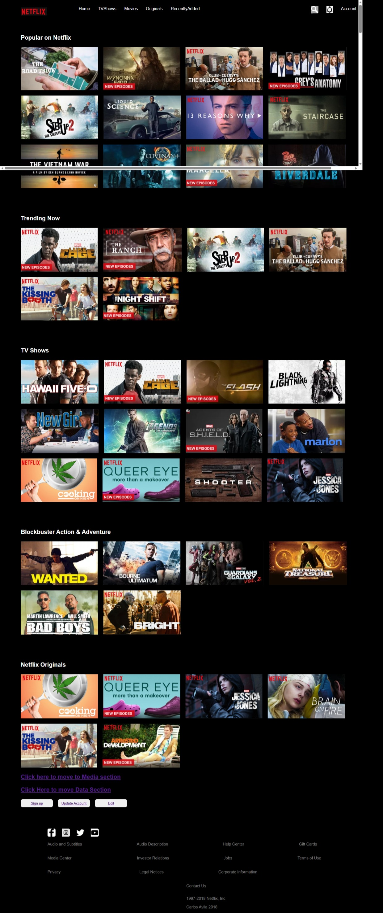
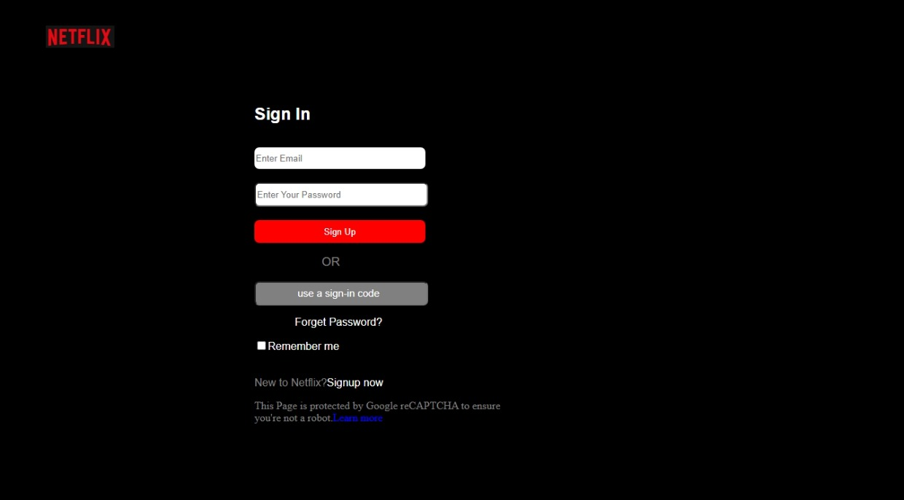
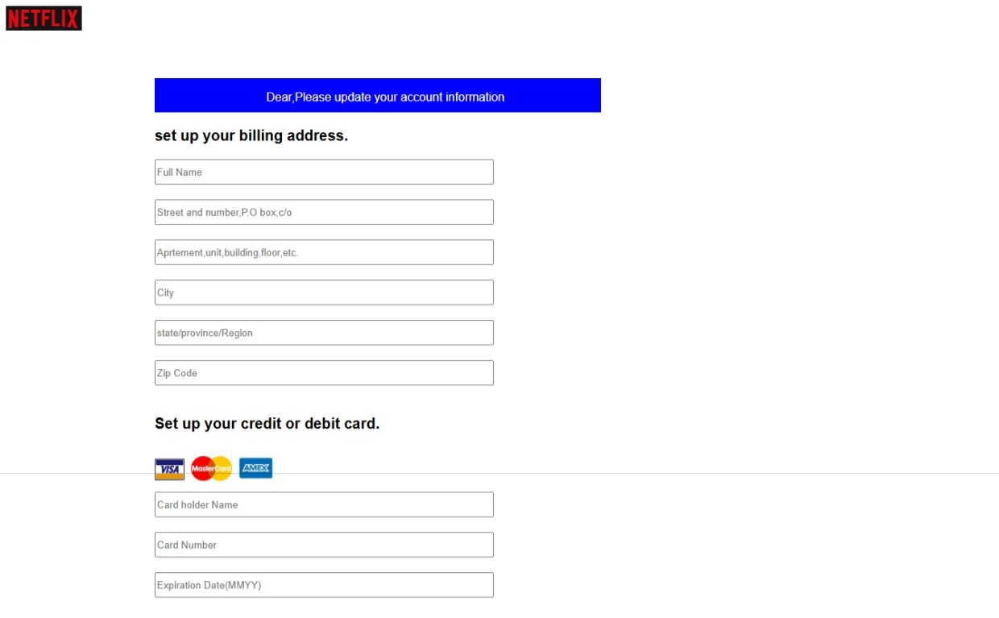

# Netflix Clone

A responsive Netflix-inspired streaming platform developed using HTML, CSS, and JavaScript.

## Features

- Netflix-style homepage with modern user interface
- User Sign Up form with input validation
- Profile Update form for managing user information
- Billing Information form for subscription details
- Responsive design for mobile, tablet, and desktop devices
- Interactive navigation and user-friendly layout
- Professional streaming platform-inspired design
- Multiple pages connected through seamless navigation

## Technologies Used

- HTML
- CSS
- JavaScript

## Project Structure

- Home Page
- Sign Up Page
- Profile Update Page
- Billing Information Page

## Purpose

This project was developed to practice frontend web development by recreating the user experience of a popular streaming platform while implementing form handling, user profile management, and responsive design principles.

## Learning Outcomes

- Responsive Web Design
- Form Validation
- DOM Manipulation
- Event Handling
- Multi-page Website Development
- User Interface Design
- Frontend Application Development

##   SCREENSHOTS

##   HOMEPAGE

##   SIGNUP PAGE

##   UPDATE_PROFILE PAGE

##   EDIT_PROFILE PAGE
![edit_profile page] (images/edit_profile.jpeg)
